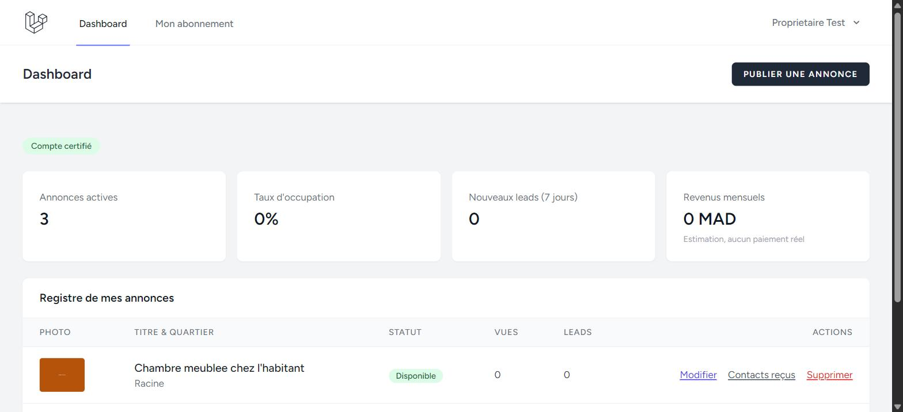
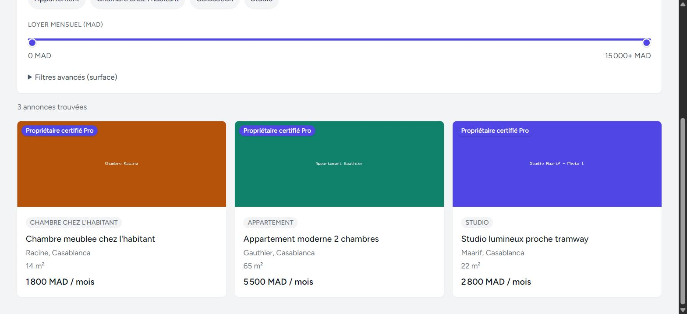
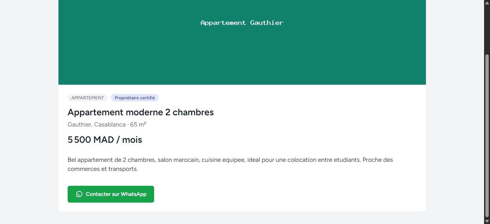

# Guide utilisateur ImmoKeys

Ce guide explique, en langage simple, comment utiliser ImmoKeys selon que vous êtes **propriétaire** (vous louez un logement) ou **étudiant** (vous en cherchez un).

## Sommaire

- [Parcours propriétaire](#parcours-propriétaire)
- [Parcours étudiant](#parcours-étudiant)

---

## Parcours propriétaire

### 1. Inscription

Depuis la page d'accueil, cliquez sur **S'inscrire** et choisissez le rôle **Propriétaire**. Un compte est créé immédiatement, mais il n'est pas encore possible de publier une annonce : ImmoKeys doit d'abord vérifier votre identité, pour que les étudiants puissent avoir confiance dans les annonces publiées.

### 2. Compléter mon profil et envoyer sa pièce d'identité (CIN)

Sur votre tableau de bord, un bandeau vous invite à **compléter votre profil**. Cette étape demande :

- votre **numéro de téléphone** (celui qui sera utilisé pour être contacté sur WhatsApp) ;
- une **photo ou un scan de votre carte d'identité (CIN)**, au format image (JPG, PNG) ou PDF, 5 Mo maximum.

Une fois envoyé, votre dossier passe au statut **« En attente »**.

### 3. Attente de validation

La vérification est faite **manuellement par un administrateur ImmoKeys** (il n'y a pas de lecture automatique du document). Le délai dépend du volume de dossiers à traiter. Deux issues possibles :

- **Approuvé** : votre compte devient certifié (badge « Compte certifié » sur le tableau de bord), et vous pouvez désormais publier des annonces.
- **Refusé** : un message vous explique que le document n'a pas été accepté ; vous pouvez alors renvoyer une nouvelle pièce d'identité.

### 4. Publier une annonce

Une fois certifié, le bouton **Publier une annonce** devient actif. La création se fait en 3 étapes :

1. **Infos générales** : titre, catégorie (Studio, Appartement, Chambre chez l'habitant, Colocation), description.
2. **Localisation & prix** : quartier (à Casablanca), surface (optionnelle), loyer mensuel.
3. **Photos** : ajoutez une ou plusieurs photos (JPG, JPEG, PNG ou WEBP).

Votre annonce est créée avec le statut **« En attente »** — vous pouvez ensuite la faire passer vous-même à **« Disponible »** depuis la page **Modifier**, dès qu'elle est prête à être vue par les étudiants (ou à **« Louée »** une fois le logement trouvé).

### 5. Suivi des leads (contacts reçus)

Le tableau de bord propriétaire affiche, pour chaque annonce :

- le nombre de **vues**,
- le nombre de **leads** (clics sur « Contacter sur WhatsApp » reçus),
- un lien **Contacts reçus** qui liste les étudiants vous ayant contacté et la date du contact.

Des indicateurs globaux sont aussi affichés en haut de la page : nombre d'annonces actives, taux d'occupation, nouveaux leads sur les 7 derniers jours, et revenus mensuels estimés (à titre indicatif — **aucun paiement réel n'est effectué sur la plateforme**).

---

## Parcours étudiant

### 1. Rechercher un logement

La recherche d'annonces est **accessible sans compte**, à l'adresse `/annonces`. Vous pouvez affiner les résultats avec :

- une **barre de recherche libre** (quartier, résidence, université...) ;
- des **quartiers populaires** en un clic (Maarif, Gauthier, Racine...) ;
- la **catégorie** de logement ;
- une **fourchette de loyer mensuel**, avec un double curseur ;
- des **filtres avancés** pour la surface.

Le nombre d'annonces trouvées se met à jour automatiquement à chaque changement de filtre, sans recharger la page.

### 2. Consulter le détail d'une annonce

En cliquant sur une annonce, vous accédez à sa page détaillée : photos, description complète, quartier, surface, prix, et un badge **« Propriétaire certifié »** si le propriétaire a été vérifié par un administrateur et dispose d'un abonnement Pro actif.

### 3. Contacter le propriétaire sur WhatsApp

Le bouton **Contacter sur WhatsApp** est visible sur toutes les annonces, mais son comportement dépend de votre situation :

- **Vous n'êtes pas connecté** : vous êtes invité à vous connecter (ou à créer un compte étudiant) avant de pouvoir contacter un propriétaire.
- **Vous êtes connecté en tant qu'étudiant** : le bouton ouvre WhatsApp avec un message pré-rempli mentionnant l'annonce, prêt à être envoyé au propriétaire. Ce clic est enregistré par ImmoKeys (à des fins de statistiques pour le propriétaire), mais **aucune messagerie interne** n'est utilisée — l'échange se poursuit directement sur WhatsApp.
- **Le propriétaire n'a pas renseigné de numéro, ou l'annonce n'est plus disponible** : le bouton l'indique clairement plutôt que d'échouer silencieusement.

### 4. Gérer son abonnement

Depuis **Mon abonnement**, un étudiant dispose par défaut d'un compte **gratuit**. Un abonnement **Premium** peut être activé en un clic — il s'agit d'une **simulation**, sans paiement réel, qui retire notamment les bannières publicitaires affichées aux comptes gratuits.
